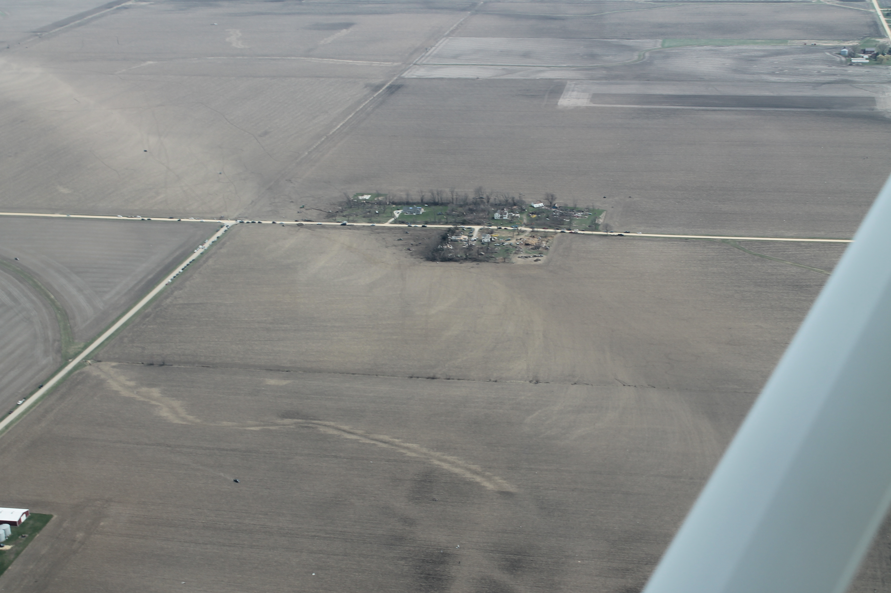

It felt great to be back in the air with my instructor – getting my proficiency levels back into check so that I can knock out the remaining stages of my PPL. In case you were wondering, I haven’t been up in the air since 12/7, where I completed a refresher flight in anticipation for my XC flights. Unfortunately, the winter was rough and many trips were cancelled at the last minute, As more and more flights were cancelled, my proficiency levels depleted and I lost the confidence I so greatly need to succeed when up in the air.

Additionally, in March my medical certification lapsed and I had to deal with Oklahoma City for renewal. This took approximately 4 weeks longer than anticipated, which left me for a period of time unable to fly at all. When my medical certificate finally arrived, the validity period increased from 12 months to three years, a big and happy surprise.

My 4/12 flight began with a weather check. Visibility and cloud clearance standards were not going to be an issue. We were departing DPA, a Class D airport where minimum criteria is – 3 Statute Miles visibility, 500 feet below, 1,000 feet above, and 2,000 feet horizontal separation from visible clouds. Our enroute phase of flight to DKB (our training field) would consistent of transgressing predominantly Class E airspace, where the limits are, when below 10,000 MSL and during daytime: 3 Statute miles visibility, 500 feet below, 1,000 feet above, and 2,000 feet horizontal separation from any visible clouds.

The winds however, were gusting; 190 / 17, G23. This made me naturally a bit nervous but as soon as I jumped into the A/C of choice – a 1986 Cessna 172P with registration N62681, I felt right at home. I reviewed the technical log book and the only squawk was a possible taxi-light issue, which during the day, did not pose any issues. I briefed for a 20R departure with a turn to 270 at approximately 1,500 MSL. I set the radios, obtained takeoff clearance, and was on my way. Climb out was uneventful. Because of the winds, I elected not to rotate at 55 IAS but rather at approximately 62 IAS, with a more firm and aggressive rotation. This was not to be caught in any downdraft or wind shift while on the takeoff roll. Since the winds were aligned with the runway, correction was not necessary.

Next time on departure, I need to ensure I maintain the runway heading and not deviate into the takeoff path of 20L aircraft. This could potentially be a hazardous situation if gone unnoticed. We climbed uneventfully to 3,000 feet, where I established cruise power and leaned the mixture accordingly. Brad wanted to practice some air-work at altitude, and the first was the infamous power-off stall. GMC, then throttle 1,700 RPM, first notch of flaps, followed by full flaps, power idle, pull up until you hear the stall horn, feel buffeting and general poor responsiveness from the controls, until the airplane breaks and pitches down. At that point, Carb heat – COLD, power full, level off and then establish slow climb, and retract flaps as necessary. This procedure must be ingrained into the pilots habitual action plan.

The next procedure were steep turns. For steep turns, first one must establish a safe perimter through clearing turns and scanning for traffic. Second step would be to establish Va of 99 IAS, and finally entering the turn one will require a bit additional power. Maintaining the turn is rather simple, and requires constant control back pressure. My steep turn to the left was great, and to the right I suffered a loss of approximately 10 IAS and 200 Feet. I need to work on my right steep turns before my practical test.

Cross-wind landings at DKB were next on the agenda. My first landing was terrible. My second and third however were good. I am slowly beginning to understand the concept of low-wing, and opposite rudder to counteract the adverse effect of a strong cross-wind. The procedure must be ingrained into my skill set through constant practice and repetition.

After our stint at DKB, we departed again to the west to investigate the Fairdale, IL EF-4 tornado that pounded the area just days before my flight. You could see the path of the tornado through the corn fields, and as it eventually came right through the small town. See the attached images.

