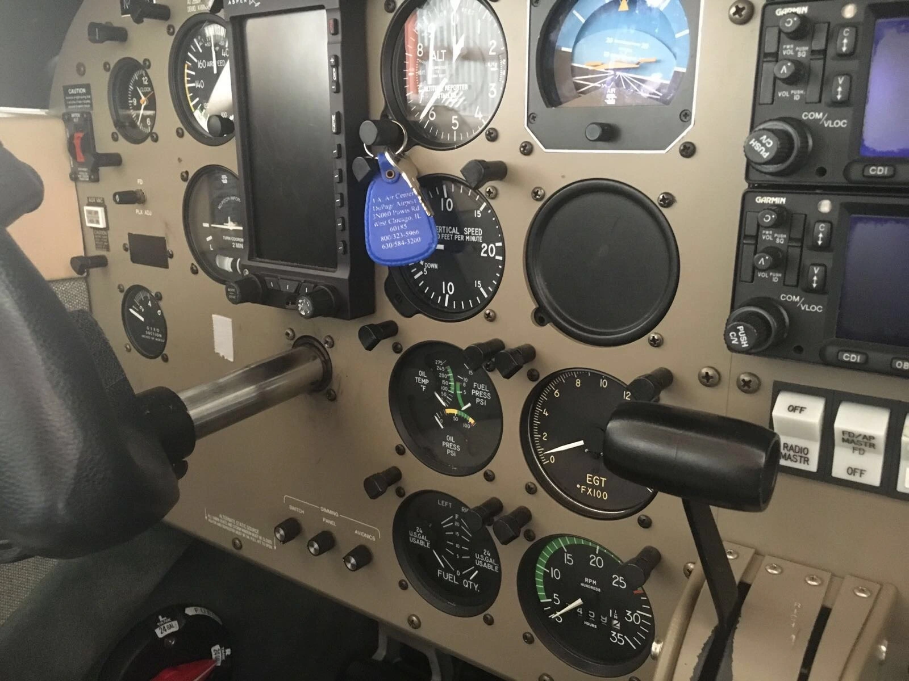

I was scheduled to fly my club’s “coolest” aircraft, a PA28-181 out of DPA for my checkride today. It’s a bit of a big deal for me because since day one of my flight training which began on 3/17/2007, I’ve been a Cessna driver. Now I have nothing against Cessna nor am I bashing the 152/172 series aircraft, but I have felt an urgent desire to shift to low-wing aircraft over the last couple of months. All my previously logged hours will no doubt serve to make me a competent pilot in my future role of flying predominantly Piper aircraft (I hope).

The weather cooled down significantly from yesterday here at DPA, with an OAT of 77F and a solid BKN200 layer overshadowing the field. My preflight inspection was as thorough as it was ever going to be, as I began to understand the design of Piper Cherokee aircraft. Three fuel drains, manually activated flaps (which in my opinion is the most funky thing I have had to deal with during the transition) and keeping in mind to monitor fuel tanks and run the fuel pumps at specified times during your flight.

Takeoff was normal, though it felt more heavier and reluctant to leave the ground. It finally did, and we climbed out a little faster than Best Climb, which is 76 KIAS in this aircraft. We made our way to the NW of the field to practice some slow flight, power off stalls, and emergency descents. Thereafter we proceeded to DKB to join the “zoo” of pilots using random/various runways and each doing what they pleased. It scared my instructor and I enough to leave DKB after only performing one landing.

We came back to DPA and finished up with three more landings to a 14 knot crosswind. The airplane behaves differently in crosswind landings and I felt myself struggling trying to figure out how best to put her down. She doesn’t bounce – which is a pleasure in a crosswind landing. When you put her down, she is more or less staying down.

My general impression of the Piper Archer is favorable. The airplane definitely feels more stable in flight. I logged 1.5 hours in it today, and hope to log a lot more this year. My next trip will likely be a cross country to KYVS. I’d like to fly somewhere less cluttered with aircraft where I can get a feel for all the various sytems on board the aircraft, especially the Aspen EFD 1000 and the 430W and AP. Once I become comfortable in this aircraft, I’ll begin offering rides to my friends.

Finally, I’ve been spending some time recently studying on my recent acquisition – a annual subscription to ForeFlight! The software is fantastic and is packed with all sorts of useful information to the pilot, including NOTAMs and weather depiction charts of all varities. I’d like to be able to utilize it on a long cross country as well, where I can learn all the intricate details that this software has to offer.

