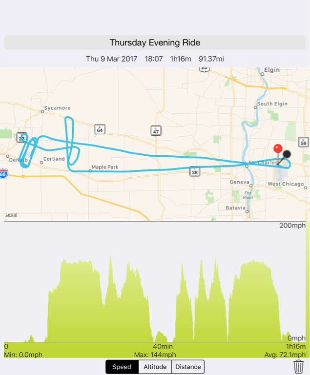

The weather was a little cooler than I would have anticipated – I finally got to see how the ground plug unit works to keep the engine warm in the colder months. Taxi and takeoff were uneventful, though I was a bit rusty. Scanning the overhead panel for the beacon light, Brad was quick to retort, “this plane doesn’t have a beacon light.” Eh – it’s been a while.

The last flight I logged was back in August 2016, right before the marriage and home purchase. Rightfully so, both events required a large supply of cash which eliminated the question of spending money on my hobbies. After all the dust has settled and we purchased a beautiful home in Elmwood Park – I’m back to plotting some interesting day trips with friends and relatives for 2017.

A majority of the checkride consisted of re-acquainting myself with the Piper Archer III, and more specifically dreadfully realizing how absolutely uninformed I am considering the avionic packages on this aircraft. I know nothing of the Aspen E1000, minimal knowledge of the 430W, and cursory information about the STEC-55. Does this make me a terrible pilot? Not so much, it should not be difficult to brush this knowledge up with a little primer and perhaps an add-on or two on Prepar3d.

The only aspect of this flight that stumped me was how utterly disorganized I was for working through a hypothetical emergency scenario. I should be more quick to realize ABCDS, which is:

    A: Airspeed of 76 KIAS.
    B: Best suitable landing area
    C: Checklists which would emphasize FEMC and engine gauge checks
    D Declare on 121.5 and SQ 7700
    S Secure the cockpit for landing

If I just drill this a little more often in my pre-flight, I should get it into my memory rather quickly. Next flying adventure should be late March, beginning of April, stay tuned.

Here is a map of my route:

