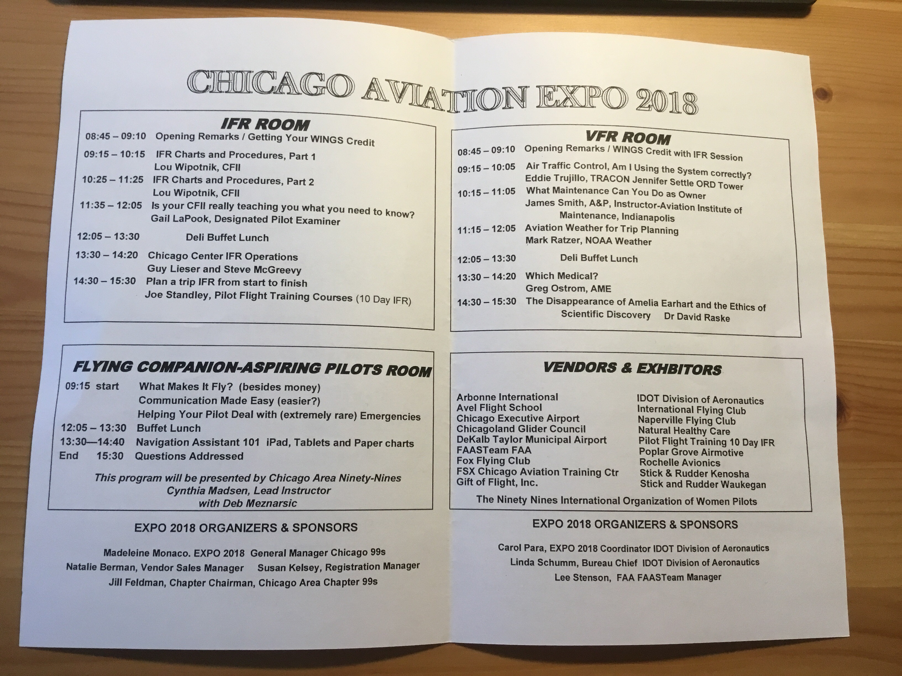

Last weekend I attended a local aviation summit in nearby Itasca, sponsored by the 99s. It’s a free event that brings together around 300 pilots to participate in a series of various refresher courses with the subliminal purpose of getting us back into the groove of flying for the Spring. An added benefit to attending the event is the FAA wings credit that you are awarded with that can be used to achieve various objectives through the WINGS program. Sadly I don’t know much more about this program, other than you receive various numbers of credit hours for continuing your aviation education. Our flying club had a booth set up where we discussed our club with potential prospects, and other vendors were present as well. These included the DKB and PWK airport authorities. Below is an image of the syllabus from the 2018 Chicago Aviation Expo

The summit is split into three “tracks”, VFR, IFR, and “Flying Companions – Aspiring Pilots”. In years past, I would have been more inclined to sit in the VFR seminars – learning about topics such as turbulence, or, which GPS is best to pair with your IPad. But this year I was strongly inclined to attend discussions relating to IFR procedures. I’ve really been debating how I’d like to begin my IFR training, but I know that before any of that can begin, I will first need to accumulate the hours toward the rating – by logging Simulated IMC and XC time. I intend to do this with a lot of flying with friends.

The first seminar was directly related to IFR procedures – providing a review of typical approaches you would see in addition to a  discussion of IFR symbology and holding procedures. Various procedures were analyzed including minimum altitudes, decision altitudes, ILS approaches, lighting, etc. The presenter didn’t seem in absolute command of the material, and some aspects of the presentation were off putting (not answering the question that was asked seemed to be a recurring topic). Additionally, he had outdated charts he was referencing and when fellow pilots in the room pulled up the same approach in ForeFlight, they had a completely different depiction of the approach procedure! Nevertheless, I did gain some basic valuable insights into IFR flying that I wouldn’t have otherwise received, and so I am thankful for that. The pilot crowd was quite engaged in the material too, which I often find to be the case with GA pilots. There was a lot of productive dialogue related to the interpretation of approach charts.

The second presentation which directly followed the first was a genuine pleasure to listen to. A DPE named Gail discussed her experiences related to check rides over the course of the last twenty years. She’s been at it a while, and could first hand describe to you the changing nature of pilot training in our constantly technologically evolving society. Her biggest gripe though wasn’t the magical EFB and general ignorance of building skills related to spatial orientation and IPads; her gripe was with aviators logging hours for ratings by performing “shuttle” runs between three or four of the same airports until enough hours have been accrued to apply for the next rating or license. This is not the definition of gaining experience, from a strict interpretation. There is no sense of truly gaining experience – which I would define as venturing off into unknown lands or slowly flying into a warm front and generally poor weather. These are skills that can only be built by slowly and safely pushing the envelope and boundaries of your own comfort level. Additionally, some other key notes from her presentation included not being reliant on the technology (as we always hear….) and flying in all different types of scenarios, to help you learn and adjust to unknown situations.

After lunch the afternoon seminar focused on a presentation concerning Basic Med. An update regarding my medical status will be thoroughly documented in another post, soon to come!
