As I was mentioning in my previous post, I signed up to participate in the bi-annual CTP event hosted by VATSIM UK. These events are always scheduled to occur around April and October; with one flight tracking westward and the other flight tracking eastward. The April flight tracks westward. I received my routing the evening before so I could begin to dissect it and take into consideration alternate airports for emergency scenarios. I always fly the PMDG777 with random failures turned ON. It adds a good bit of realism to the whole experience, even if it would possibly mean you not being able to arrive at your final destination. I have yet to experience any sort of significant failure, however.

My initial flight routing between EPWA and KORD was as follows:

**OLILA L621 ROE M743 ALM L975 BAVTA L983 PETIL L983 GOW DCT MIMKU DCT PIKIL 5720N 5830N 5840N 5750N HOIST N604B YMT SSM TVC WYNDE8**

With Track A across the Atlantic. The NAT track portion of the flight route begins at PIKIL and ends at HOIST. My CTOT (Confirmed Take Off Time) was at 12:22Z, and I connected to VATSIM at EPWA at Gate 45 approximately 45 minutes before the scheduled departure. I fired up a Cold & Dark scenario and begun making the planning preparations for the flight. To begin, these were my weights:

My ZFW was 422.8 and for the planned 9:28 minute flight, I’ll need approximately 150,288 pounds of fuel. The actual flight time ended up being just a few minutes more, at 9:36 minutes. I had MSN as an alternate airfield which required alternate fuel requirements of 5,822 pounds. As preparations were being made for the Atlantic voyage – the fuelers were busy pumping the 171,000 pounds of JET-A required for the flight. PMDG has done an excellent job simulating fueling operations for the 777. Upon calling EPWA Delivery for our clearance, which was precisely the same route as what was given to us via e-mail the night before, we were additionally cleared for the OLILA6G departure with an initial altitude restriction of 6,000 feet. We began taxi for the departure runway 29 approximately 12:15Z, and arriving in the hold short queue as number 7ish for departure:

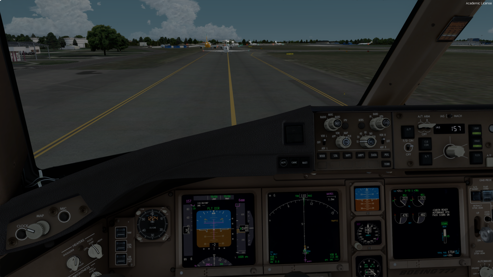

Unfortunately, I do not have a fancy AI package and so all aircraft were appearing as narrowbody CRJ’s. I had also purchased a subscription to Navigraph for the event, so I can track my aircraft position in real time on all the different charts I’ll be utilizing throughout the course of the flight. My queue in the hold short line appeared as so:

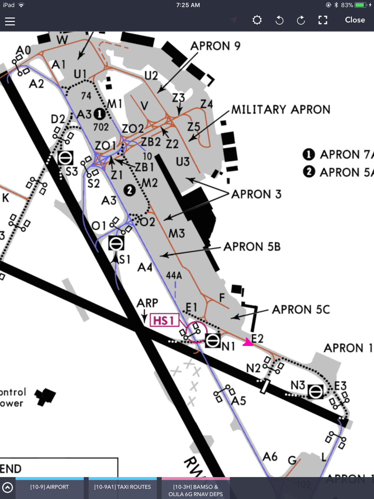

I’m the purple icon right near the E2 designator on the chart. After fifteen minutes of waiting, we were finally cleared onto the runway (note the OLILA6G SID loaded on the ND and WXR activated for the distant TCU’s):

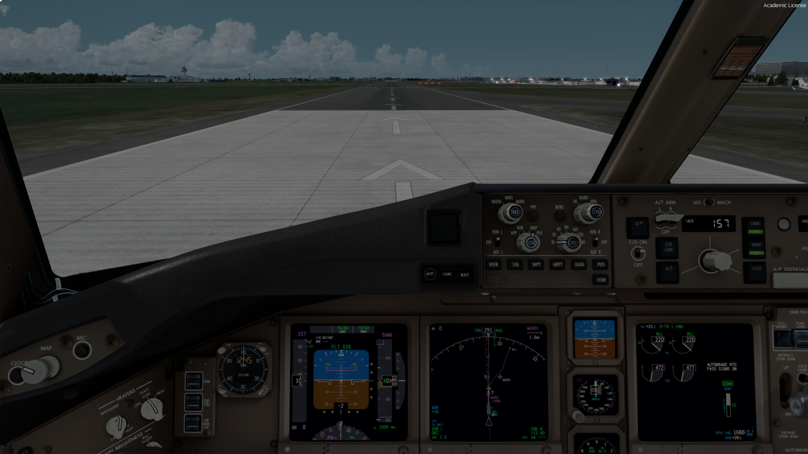

The departure on the chart looked as follows, though we did not follow the SID star all the way through, we were given at least two DCT waypoints shortly after clearing FL120:

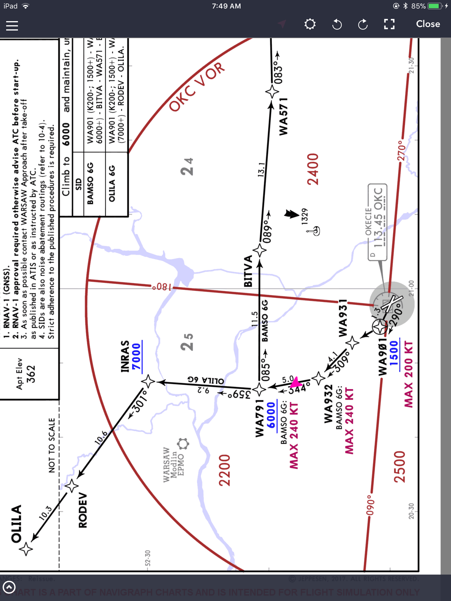

I climbed for my initial clearance altitude at FL and was handed over to Warsaw Radar, and thereafter Swedish Radar and Copenhagen, etc. The flight through Europe was smooth, and the only hiccup I encountered was with my own aircraft; the vertical navigation profile for my flight was unavailable, and I lost all ETA and fuel predictions as well as altitude constraints throughout the duration of the flight. It did not pose as much of a problem as I originally anticipated, and I continued the flight without any other significant complications.

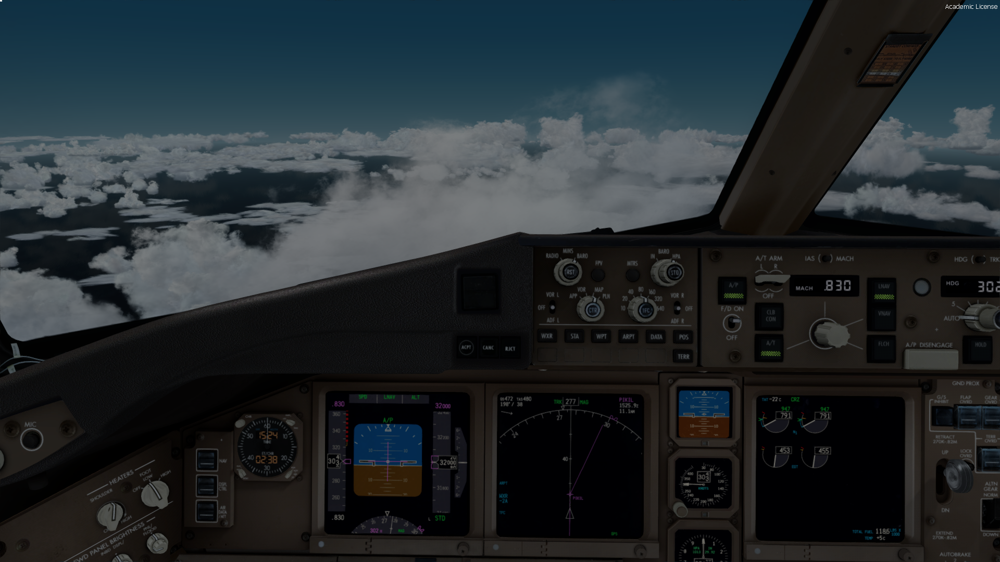 
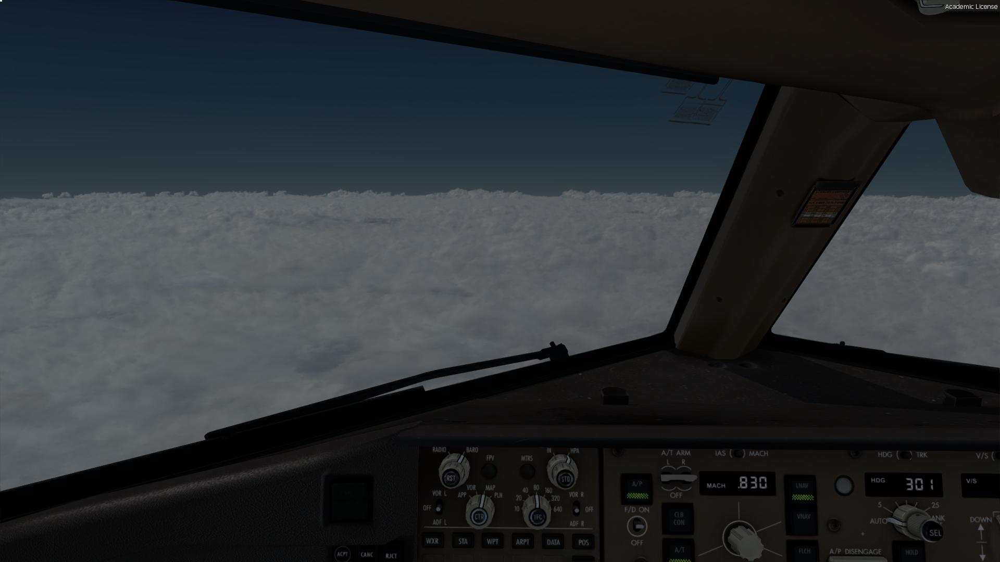
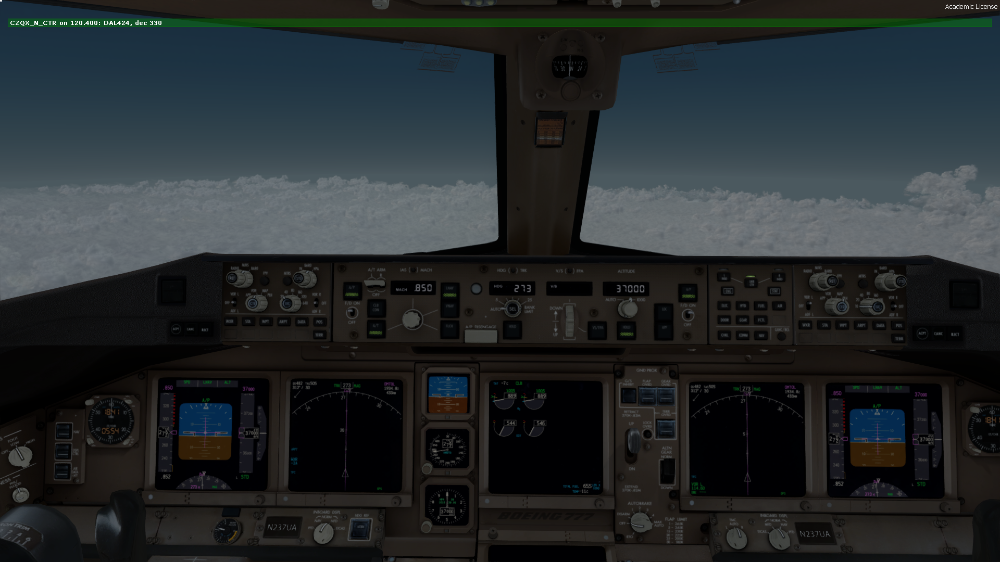
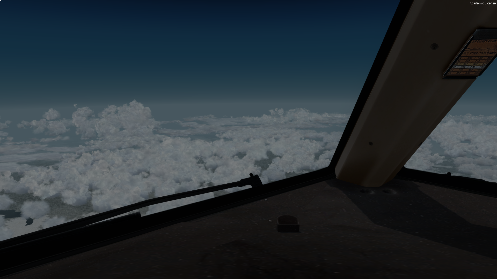

The flight on NAT Track A was uneventful and routine. I had no traffic within my immediate vicinity so spacing restrictions were not so much of an issue for me. Upon maing Landfall, I requested a S/C to FL370 and FL380 and then we were handed over to Gander Domestic and Montreal Center and then Toronto Center, before being handed over to Minneapolis Center who began making prepartions for our arrival into ORD. The weather we were expecting was going to make the approach challenging, with the following TAF outlining our expectations of arrival into ORD:

Our arrival was scheduled for approximately 22:00Z or so, we were looking at winds 06023G33KT and 4SM visibility with an overcast layer at OVC005. Low IFR conditions for sure. The weather radar WYNDE8 arrival looked as follows:

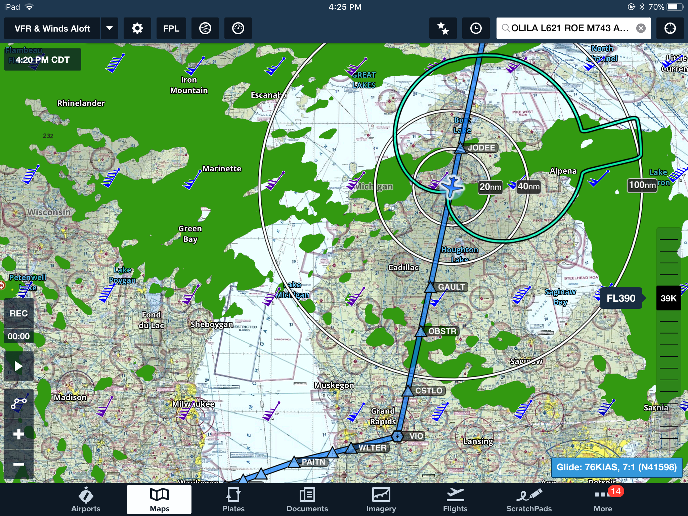

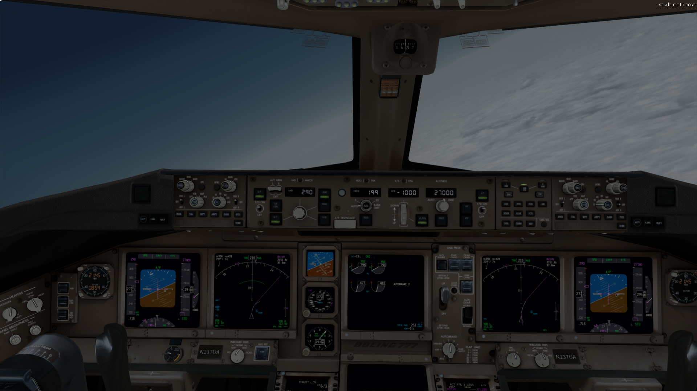

As we were snaking our way towards ORD on the WYNDE8.SSM.10L arrival, i was following along on the Navigraph app to ensure all crossing restrictions were consistent with ATC expectations:

Right as we hit the shoreline to Chicago, we were then handed over a couple of more times through the various Chicago Approach frequencies and eventually were given vectors from TUBEZ, heading 180, thereafter heading 270, thereafter heading 060 to intercept the 10L localizer. After reviewing the approach plate for the ILS/LOC 10L into KORD, I dialed in the various radio aids and minimums settings and quickly briefed the approach. It’s much harder to perform all this under single pilot operations! After entering the clouds at 8,100 MSL, we didn’t break out until a minute or so before landing! Unbelievable! Here we were at 1,600 MSL with another 800 feet to go to minimums with no runway in sight.

Shortly thereafter, at 1,100 MSL we saw the ALSF-2 lighting into 10L, and the autopilot was disconnected for a manual landing:

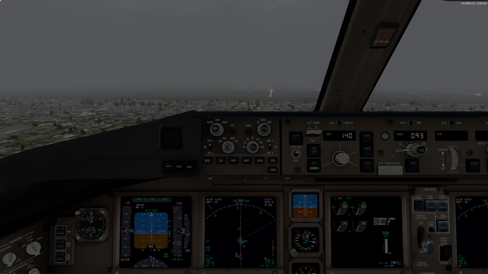

At this point, a quick verification between the ORD METAR showing OVC005 and my altimeter, where ORD elevation is ~700 Feet, 700 + 500 = 1,200 MSL. The METARs were spot on with the weather depicted! AS2016 does a great job of simulating weather.

Overall, my impressions on this cross the pond were as follows:

  - A big thanks to all participating ATC facilities. Warsaw was hands down the smoothest departure airport I have ever flown out of. Everyone was professional, courteous, and the staff was competent. The WORST experience I ever had was at KIAD, where i sat at the gate for three hours waiting to get my clearance for departure. It got to the point where people were just disconnecting and flying out and re-connecting once airborne.
  - Chicago O’Hare was a great experience flying into. In the past, I have had a couple of difficult encounters flying into ORD, mostly in the form of missed descent instructions and blown ILS approaches with bad vectoring/spacing. Luckily, this time everyone was on top of their game. A great experience flying into ORD with MIFR weather.
  - Active Sky 2016 does a phenomenal job of recreating weather. Sitting by the controls for this entire long haul flight, I was able to see the various weather systems come and go, with no significant “popping” of clouds at any point.
    P3Dv4 is an incredibly stable platform for flight simming. 64-bit was really a god send for the PC aviation community, I no longer experience any random CTD’s or any other issues that I used to be absolutely terrified of during CTP.
