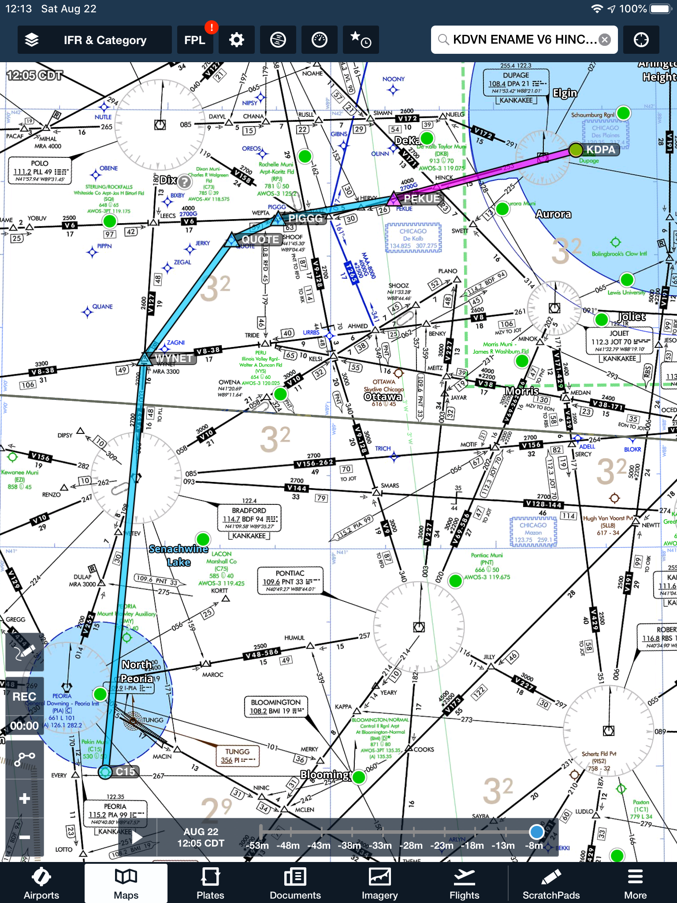
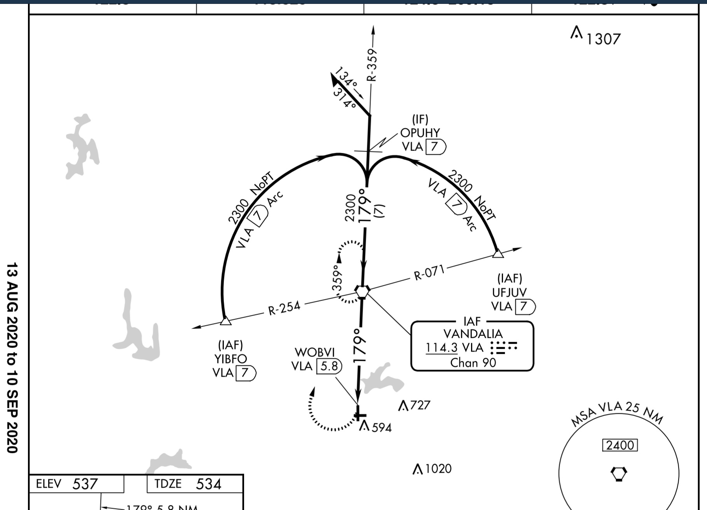

---
<<<<<<< HEAD
title: Instrument XC Flight
date: '2020-07-07'
=======
title: Instrument Cross Country Flight
date: '2020-08-23'
>>>>>>> 52d1dd3 (Finished upload of blog posts.)
summary:

authors:
  - admin

tags:
  - Flying

categories:
  - Aviation

---
Yesterday, my instructor and I planned to complete the long cross country portion for the instrument rating Part 61 requirements. The original plan was to fly KDPA -> C15 -> KDVN -> KDPA. However, upon further research, it was determined that we didn’t actually have to fly to three different airports.

We therefore shifted our flight plan several times until we finally arrived at flying down to KVLA for the VOR/DME 18 approach which included an ARC. VOR/DME ARC approaches are quite rare in the Midwest, so in order to get the experience of flying it we planned to fly to Vandalia.

I filed the flight plan through ForeFlight, which is neat because you get messages relayed back to you that may give you revised routing instructions, or any other restrictions or changes to your flight plan that have occurred since filing. The briefing portion of ForeFlight is additionally fantastic. It walks you through, page by page, an articulate summary of your entire route of flight. Reviewing things such as NOTAMs, weather, airport information, and TFRs.

We filed for 8,000, which we got. Departure was uneventful. I was given a variety of level-offs before reaching our final cruise altitude, which is to be expected when flying under the shelf of a Class B. I believe they were 3000, 4000, 5000 and 8000 for the altitudes. Throughout the course of the entire flight, I was continually left of course, the aircraft was continually turning to the left at a slight rate. My instructor pointed this out to me several times, and I tried to correct it as much as possible. We worked some rudder trim settings which seemed to help with the issue. My altitude tracking on this first leg was average as well, there were slight deviations. If my instructor hounded me for anything, it was the absolute criticality of nailing down basic attitude flying. Setting and trimming the airplane to a state where you can literally fly hands off in no-turbulence weather and not have to worry too much about the airplane going too much off course. Of course, in the real world we’d be using the STEC55X for navigation guidance, so we likely wouldn’t even be hand flying a 360NM flight. However, during training, it’s best to leave the tech gadgets off and focus on the basic elements of instrument flying.

The flight at altitude really was uneventful. We had some frequency changes along the route, which I did not write down but instead plugged directly into the GPS430 COMM frequency box. This was probably not the best way of handling this issue, however, I found it quite effective and quick to get right over to the next frequency and report.

As we started getting in closer to our destination, we had two different navigation based approaches we were looking to shoot. Kansas City Center was very accommodating with our requests. The first was the VOR/DME 18 ARC, which terminated with a missed procedure into a hold, where we’d then obtain vectors for the straight in RNAV GPS 18 terminating in a full stop landing.

<<<<<<< HEAD
Approach 1: VOR/DME 18
=======
*Approach 1: VOR/DME 18*
>>>>>>> 52d1dd3 (Finished upload of blog posts.)

This approach was pretty nutty. First of all, our GPS430 gave us the STEEP TURN AHEAD warning in the message box when we were flying towards UFJUV, the IAF for the DME ARC. I descended down to 2,300 and performed a left hand turn at 30 degrees bank to intercept the DME ARC and fly it at 7NM. The lateral limits there is +/- 1NM on either side. Therefore, if during the ARC I was at 6.84, I’d still be .84NM away from the protected area to the left of the ARC. I followed this ARC through to the IF, as seen below:

The IF was OPUHY, where a turn to the final approach course of 179 degrees magnetic was required. You then follow this to the FAF (VLA). Once crossing the FAF you are allowed to descend down to 1140 MSL where you’ll be at the MDA and in a position to make a landing, remember, three things need to occur for you to make the landing and go under the MDA:

<<<<<<< HEAD
- In a position from where you are able to make a safe landing from
- The required flight visibility is acquired, 1SM in this case.
- Any of the 14 or so ground-based reference points have been acquired.

I went missed at the MAP, which was WOBVI at 5.8 DME from VLA. This is basically directly above the threshold of RWY 18. I then executed the published missed approach and flew direct VLA for the hold, with a parallel entry. The hold did not last long before vectors were given straight for the IAF associated with the RNAV GPS.

Approach 2: RNAV GPS 18
=======
  - In a position from where you are able to make a safe landing from
  - The required flight visibility is acquired, 1SM in this case.
  - Any of the 14 or so ground-based reference points have been acquired.

I went missed at the MAP, which was WOBVI at 5.8 DME from VLA. This is basically directly above the threshold of RWY 18. I then executed the published missed approach and flew direct VLA for the hold, with a parallel entry. The hold did not last long before vectors were given straight for the IAF associated with the RNAV GPS.

*Approach 2: RNAV GPS 18*
>>>>>>> 52d1dd3 (Finished upload of blog posts.)

The RNAV GPS approach was more straightforward than the VOR/DME approach before. It was again, an LNAV only approach with +V for vertical guidance (advisory in nature). My course corrections were quite significant on this approach, and it was not a great approach. I flew it down to the MDA and went visual at the VDP. I landed and we taxied to get fuel and head back home to DPA. However, the fuel tank was broken and we unfortunately had to fly over to 2H0 for fuel and head back home IFR to KDPA.

The final flight back home was at 5,000 feet, a very smooth and calm night. I was able to trim the aircraft out almost perfectly. It required little to no attention to stay on course. During this leg, ATC came on with an amendment to my routing and advised when I was ready to copy. I told them ready to copy and they gave me the waypoint PLANO instead of JOT to make it a more direct flight. We requested and got the ILS/LOC 02L at KDPA with vectors to final. I flew this approach quite well, with little vertical oscillations but more so lateral oscillations. I got out of the hood right at DA and the runway was right in front of me and I was in a good position to land.

Things I took away from this flight:

<<<<<<< HEAD
- Blue diamond on the green course needle on the Aspen EFD to stay on track.
- De-clutter your display units as necessary!
- Maintain small changes to your heading/course, and continually make small corrections.
- The quicker you trim the airplane out, the better you’ll be on the overall quality of maintaining your DTK.

I logged 5.2 HOBBS on this flight, which will almost get me to where I need to be for check-ride ready status. I have some more work to do with instrument approaches, flying a bunch of them back to back to get me checkride ready. But other then that, I’m looking to be in good shape for it!
=======
  - Blue diamond on the green course needle on the Aspen EFD to stay on track.
  - De-clutter your display units as necessary!
  - Maintain small changes to your heading/course, and continually make small corrections.
  - The quicker you trim the airplane out, the better you’ll be on the overall quality of maintaining your DTK.

I logged 5.2 HOBBS on this flight, which will almost get me to where I need to be for check-ride ready status. I have some more work to do with instrument approaches, flying a bunch of them back to back to get me checkride ready. But other then that, I’m looking to be in good shape for it!
>>>>>>> 52d1dd3 (Finished upload of blog posts.)
